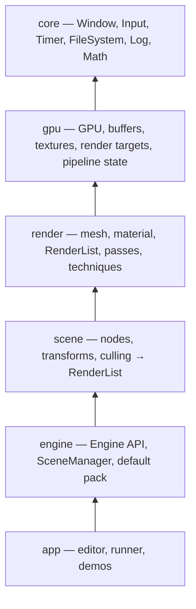

# Radion

[](https://github.com/akadjoker/Radion/actions/workflows/release.yml)
[](https://github.com/akadjoker/Radion/releases)
[](LICENSE)

A desktop-first 3D game engine written in C++17, built around OpenGL 4.5 core.

Radion is a from-scratch engine with a component-based scene graph, a forward
renderer with full post-processing, a real-time editor, a physics and AI
toolchain, and its own scripting language. It ships with no web, mobile, or
GL ES support — deliberately.

## Highlights

- **OpenGL 4.5 core, single backend.** Direct State Access (`glCreate*`,
  `glNamed*`), SSBOs, compute shaders and `glDrawIndirect` are used without a
  single `#ifdef`. Target: desktop only.
- **Component-based scene graph.** `GameObject` + component composition via a
  `Scene`, with full hierarchy and transform support.
- **Forward renderer** with shadows (directional / point / spot), GPU light
  culling, planar reflections, lightmaps, and a post-processing stack
  (temporal AA, ambient occlusion, volumetrics, lens flares).
- **GPU-simulated effects:** grass, hair, particles, and water/ocean — all
  simulated and culled on the GPU with compute shaders.
- **Editor with docking panels** built on ImGui: viewport, game view,
  hierarchy, inspector, assets, animation, lightmaps, mesh tools, volume
  editing, profiler, and more.
- **Blender-style mini mesh editor** (`radion_blender`) for mesh editing and
  keyframe animation.
- **Physics** — rigid-body dynamics, joints, vehicles, soft bodies, character
  controllers, and convex-hull collision.
- **AI** — navigation meshes (Recast), pathfinding, steering behaviors, state
  machines, squads/formations, and grid pathfinding.
- **Geometry toolkit** — convex hull computation, CSG volumes, Voronoi
  shattering.
- **Built-in scripting** — the Zen language VM is vendored and bound into the
  engine (`ZenBehaviour`, `ScriptComponent`).
- **Asset pipeline** — a packer produces a compiled, encrypted (ChaCha20) asset
  pack with async texture loading and scene serialization.
- **Tested** — CTest suite covering scene logic, physics, AI, geometry, mesh
  import/clipping/optimization, and file packing.

## Architecture

Layers are strictly one-directional: each layer only knows the one below it.
`scene/` never includes anything from `gpu/`, and `render/` never knows what a
`Node` is.



- **`core/`** — platform layer: SDL window + GL context, input, filesystem,
  zip archives, encrypted file packs, logging, timer, math, profiling.
- **`gpu/`** — the graphics API. Pipeline State Objects (not command buffers):
  a `PipelineHandle` groups blend + depth + cull + shader + layout and doubles
  as the render-list sort key.
- **`render/`** — meshes, materials, the `RenderList`, all render passes and
  techniques, asset loading.
- **`scene/`** — game objects, components, transforms, culling; produces the
  `RenderList` consumed by `render/`.
- **`engine/`** — the concrete `Engine` API that constructs every layer in the
  right order and tears it down in reverse. No inheritance, no virtual
  callbacks: the host drives the frame with `update()` / `render()` / `flip()`.
- **`app/`** — the editor and the runner on top of the engine.

## Repository layout

```
assets/          shaders and textures
blend/           Blender-style mini mesh editor (radion_blender)
build/           out-of-source CMake build tree
cmake/           shared CMake helpers and options
docs/            internal design docs and references (mostly PT, not user-facing)
editor/          the Radion editor (radion_editor)
examples/        small demos (runner_smoke_test)
runtime/
  core/          platform layer
  gpu/           graphics API layer
  render/        renderer and render techniques
  scene/         game objects, components, culling
  physics/       dynamics, collision, soft bodies
  geometry/      hulls, CSG volumes, meshing
  ai/            navmesh, pathfinding, behaviors
  script/        Zen language bindings and script components
  engine/        the Engine public API
runner/          standalone game runner (radion_runner)
tests/           unit tests (CTest)
tools/           packer, mesh exporter, lightmap baker
vendor/          glad, glm, ImGui, meshoptimizer, miniz, nlohmann/json,
                 recastnavigation, stb, xatlas, zen
```

## Requirements

- CMake **3.21+**
- A C++17 compiler (GCC/Clang on Linux; MSVC on Windows)
- **SDL2** development libraries
- **OpenGL 4.5** capable driver
- A GL 4.5 context is assumed, so no GL ES / WebGL fallbacks exist

## Building

Radion refuses to configure in the source tree — programs land in `bin/`,
everything else stays inside `build/`:

```bash
cmake -S . -B build
cmake --build build
```

Executables are written to `bin/`.

### Build options

| Option | Default | Description |
|---|---|---|
| `BUILD_SHARED_LIBS` | `OFF` | Build Radion libraries as shared libraries |
| `RADION_ENABLE_SANITIZERS` | `ON` | Enable sanitizers in Debug builds |
| `RADION_BUILD_EDITOR` | `ON` | Build the editor |
| `RADION_BUILD_RUNNER` | `ON` | Build the standalone runner |
| `RADION_BUILD_BLENDER` | `ON` | Build the Blender-style mesh editor |
| `BUILD_TESTING` | `ON` | Build the unit tests (via `CTest`) |

## Running

| Binary | Purpose |
|---|---|
| `bin/radion_editor` | The main editor — scene authoring, materials, lightmaps, animation |
| `bin/radion_runner <scene or project>` | Standalone runner that loads and executes a scene |
| `bin/radion_blender` | Blender-style mini mesh editor (mesh editing + keyframes) |
| `bin/radion_lightmapbake <settings.json>` | Headless lightmap baker CLI |
| `bin/radion_pack` | Builds the compiled asset pack embedded into the engine |

## Testing

Tests are registered with CTest; each test links only the library it exercises
and Debug builds run under sanitizers:

```bash
cd build
ctest --output-on-failure
```

Coverage includes scene logic, AI, mesh clipping and optimization, volume/CSG,
convex hulls, mesh import, dynamics, joints, vehicles, soft bodies, collision,
bounds trees, and file packing.

## Scripting

Radion vendors the **Zen** language VM (`vendor/zen`) and binds it into the
engine. Game behavior is written as `ZenBehaviour` components attached to game
objects; `runtime/script/` provides the Radion-side bindings and
`SceneScriptBindings.h` exposes scene APIs to scripts.

## Project conventions

The engine does not bend to any particular demo — demos adjust their settings.
The demo `main` only orchestrates; rendering logic belongs in the engine. Debug
panels are complete: every parameter gets a slider with a tooltip, toggles to
isolate techniques, and render-target previews.

## License

Radion is licensed under the [MIT License](LICENSE).
